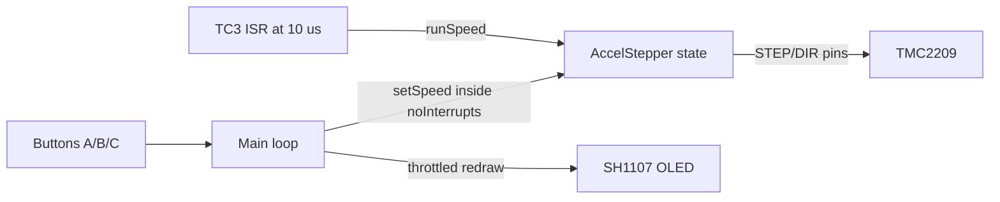

# Smooth stepping, higher ceiling, RPM-first UI

## Problem

`stepper.runSpeed()` only emits a STEP pulse when it is called. Today it lives in the main loop, so every OLED frame (~7-25 ms of blocking I2C traffic in [mouse_treadmill.ino](firmware/mouse_treadmill/mouse_treadmill.ino)) freezes the pulse train and the motor stutters. The 4000 step/s cap also leaves the motor un-exercised, and the UI leads with the wrong number.

## Fix in three parts

### 1. Jitter: drive STEP pulses from a hardware timer ISR

Keep `AccelStepper` (same library as your reference sketch), but call `runSpeed()` from a TC3-based timer on the SAMD21 instead of from the main loop. This completely decouples step generation from whatever the main loop is doing.

- Dependency: `Adafruit Zero Timer Library` (Arduino Library Manager). Works on the Feather M0's SAMD21.
- Timer period: ~10 us (100 kHz). Max practical step rate is ~20 k steps/s (~50 us between steps), so 10 us gives 5x oversampling on the fastest pulse.
- `runSpeed()` is cheap: it just checks `micros() - lastStep >= stepInterval` and, if so, toggles STEP. At 100 kHz ISR rate this is well within the SAMD21's budget.
- Main loop writes `stepper.setSpeed(currentSpeed)` inside `noInterrupts()/interrupts()` because `setSpeed()` touches the same multi-byte state the ISR reads.



### 2. Smooth speed changes: two-layer ramp

Button behaviour (confirmed):
- Hold A - target speed ramps up at `TARGET_RAMP_RATE` (default `4000` usteps/s per second).
- Hold C - target speed ramps down at the same rate.
- Tap B - toggle running (graceful stop on release, see below).

Motor behaviour:
- Actual `currentSpeed` chases `targetSpeed` at `MOTOR_ACCEL` (default `8000` usteps/s^2). Setting `MOTOR_ACCEL > TARGET_RAMP_RATE` means the motor keeps up with the setpoint while buttons are held.
- Graceful stop: pressing B when running sets `targetSpeed = 0` (conceptually) and the motor ramps to zero; driver EN is only pulled HIGH once `currentSpeed == 0`. Pressing B when stopped re-enables the driver and the ramp resumes toward the saved user target.

Per-loop math:

```cpp
float dt = (nowMicros - lastLoopMicros) * 1.0e-6f;   // seconds, measured each pass
// Target (setpoint) from held buttons:
if (isPressed(btnA)) userTarget += TARGET_RAMP_RATE * dt;
if (isPressed(btnC)) userTarget -= TARGET_RAMP_RATE * dt;
userTarget = constrain(userTarget, 0.0f, SPEED_MAX);
// Effective target depends on running state:
float effectiveTarget = running ? userTarget : 0.0f;
// Motor ramp:
float delta = MOTOR_ACCEL * dt;
if      (currentSpeed < effectiveTarget) currentSpeed = min(effectiveTarget, currentSpeed + delta);
else if (currentSpeed > effectiveTarget) currentSpeed = max(effectiveTarget, currentSpeed - delta);
```

### 3. Top speed: raise the ceiling

- `SPEED_MAX = 20000.0f` usteps/s (matches the 50 us/step ceiling from your reference sketch; at 1/8 microstep this is ~750 RPM in theory - the 4411's actual stall speed will be well below this and is what we discover experimentally).
- `stepper.setMaxSpeed(SPEED_MAX);` in `setup()`.
- Practical max is bounded by the motor, not the firmware; `userTarget` is clamped by `SPEED_MAX` only as a safety lid.

### 4. UI: RPM headline

Layout on 128x64:

- Row 0 (8 px): "Mouse Treadmill" | `[RUN]` / `[STP]`
- Rows 10-36 (text size 3): **big RPM number** (e.g. `142.3`), right-aligned
- Row 40 (text size 1): small `usteps/s: 12000` and microstep mode
- Row 54 (text size 1): hint line `A=+  C=-  B=run`

Redraws stay at 10 Hz but the UI is lighter (fewer strings), and the ISR handles steps independently so even if a draw takes 25 ms the motor keeps pulsing cleanly.

## Concrete changes to [firmware/mouse_treadmill/mouse_treadmill.ino](firmware/mouse_treadmill/mouse_treadmill.ino)

- Add include and instance:
  - `#include <Adafruit_ZeroTimer.h>`
  - `Adafruit_ZeroTimer zt = Adafruit_ZeroTimer(3);`
- Add ISR glue:
  - `void TC3_Handler() { Adafruit_ZeroTimer::timerHandler(3); }`
  - `void stepperISR() { stepper.runSpeed(); }`
- Replace constants block:
  - `SPEED_MAX` -> `20000.0f`
  - Remove `SPEED_STEP` (not used any more)
  - Add `TARGET_RAMP_RATE = 4000.0f` and `MOTOR_ACCEL = 8000.0f`
- Replace the `pressedEdge`-centric button handling with:
  - `pressedEdge(btnB)` for start/stop toggle (kept as-is)
  - `isPressed(btnA)` / `isPressed(btnC)` returning the stable (debounced) level for hold-to-ramp
- Replace `loop()` step-generation block with the per-loop math above; no more `stepper.runSpeed()` in the loop.
- In `setup()`:
  - `stepper.setMaxSpeed(SPEED_MAX);`
  - Configure the timer: `zt.configure(TC_CLOCK_PRESCALER_DIV1, TC_COUNTER_SIZE_16BIT, TC_WAVE_GENERATION_MATCH_PWM);` and `zt.setCompare(0, 480);` (480 ticks at 48 MHz ~= 10 us)
  - `zt.setCallback(true, TC_CALLBACK_CC_CHANNEL0, stepperISR);`
  - `zt.enable(true);`
- Rewrite `drawUI()` with the RPM-first layout.
- Main-loop setSpeed must be wrapped: `noInterrupts(); stepper.setSpeed(currentSpeed); interrupts();`

## Tuning knobs surfaced at the top of the sketch (so you can iterate without re-reading the design)

- `SPEED_MAX` - hard ceiling
- `TARGET_RAMP_RATE` - how fast the setpoint moves while a button is held
- `MOTOR_ACCEL` - how fast the motor chases the setpoint
- `ISR_PERIOD_TICKS = 480` - 10 us at 48 MHz; raise for lower CPU load, lower for more timing headroom

## Verification after flashing

1. OLED should show `0.0 RPM` on boot, `[STP]`.
2. Tap B - `[RUN]` appears, motor holds position silently (TMC2209 StealthChop).
3. Hold A for a few seconds - RPM number climbs smoothly, motor accelerates without audible clicks at the OLED refresh boundary. That "no click at refresh" is the jitter fix working.
4. Release A - motor holds at the new speed.
5. Hold C - RPM ramps back down to 0.
6. Tap B - motor ramps to 0, then driver audibly releases.
7. Find the practical stall speed by ramping up under load; note it and, if desired, lower `SPEED_MAX` to that value plus a small margin.

## Out of scope for this change

- Encoder feedback / closed-loop speed
- UART tuning of TMC2209 (StealthChop thresholds, current setting in software)
- Direction reversal from buttons (Phase 2 once the UX of A/B/C is validated)
