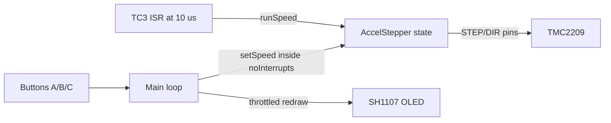

# Mouse-Treadmill Phase 1 — Smooth Stepping, Higher Ceiling, RPM-first UI

> Rework of the Phase 1 firmware for jitter-free motion: step generation moved to a SAMD21
> hardware timer ISR, motor acceleration ramp added, hold-to-ramp button UX, top speed
> unlocked, and OLED redesigned to show RPM as the headline number.

---

## Problem

`stepper.runSpeed()` only emits a STEP pulse when it is called. In the original firmware it lives in the main loop, so every OLED frame (~7–25 ms of blocking I2C traffic) freezes the pulse train and the motor stutters. The 4000 step/s cap also leaves the motor un-exercised, and the UI led with the wrong number (steps/s instead of RPM).

---

## Architecture after this change



The main loop manages button debounce, speed ramping, and the 10 Hz OLED redraw. TC3 owns step generation entirely — the OLED draw is now invisible to the motor.

---

## Fix 1: Hardware timer ISR for jitter-free stepping

Step pulses are generated from a SAMD21 TC3 hardware timer ISR calling `AccelStepper::runSpeed()` at 100 kHz (every 10 µs). `runSpeed()` is cheap: it checks whether the elapsed time since the last step equals the current step interval, and if so toggles the STEP pin.

- **New library:** `Adafruit Zero Timer Library` (Arduino Library Manager). Works on the Feather M0's SAMD21.
- **Timer period:** 480 ticks at 48 MHz GCLK = ~10 µs → 5× oversampling of the fastest pulse (50 µs at 20 000 steps/s).
- **Thread safety:** the main loop calls `stepper.setSpeed()` inside `noInterrupts()/interrupts()` because `setSpeed()` writes the same multi-byte float state that the ISR reads.

### ISR setup code

```cpp
#include <Adafruit_ZeroTimer.h>
Adafruit_ZeroTimer zt = Adafruit_ZeroTimer(3);

void TC3_Handler() { Adafruit_ZeroTimer::timerHandler(3); }
void stepperISR()  { stepper.runSpeed(); }

// In setup():
zt.configure(TC_CLOCK_PRESCALER_DIV1,
             TC_COUNTER_SIZE_16BIT,
             TC_WAVE_GENERATION_MATCH_PWM);
zt.setCompare(0, ISR_PERIOD_TICKS);   // 480 = ~10 us
zt.setCallback(true, TC_CALLBACK_CC_CHANNEL0, stepperISR);
zt.enable(true);
```

---

## Fix 2: Two-layer speed ramp

### Button behaviour

| Button | Action |
|--------|--------|
| Hold A | `userTarget` ramps up at `TARGET_RAMP_RATE` usteps/s per second |
| Hold C | `userTarget` ramps down |
| Tap B | Toggle running; motor ramps to 0 gracefully on stop |

### Motor behaviour

`currentSpeed` chases `userTarget` (or 0 when stopped) at `MOTOR_ACCEL` usteps/s². Setting `MOTOR_ACCEL > TARGET_RAMP_RATE` means the motor keeps up with held-button changes without lag. The driver EN pin goes HIGH only after `currentSpeed` reaches 0 — no abrupt power cut.

### Per-loop ramp math

```cpp
float dt = (nowMicros - lastLoopMicros) * 1.0e-6f;  // seconds
if (dt > 0.1f) dt = 0.1f;  // guard against stale first pass

// --- Held-button setpoint ramp ---
if (isHeld(btnA)) { userTarget += TARGET_RAMP_RATE * dt; }
if (isHeld(btnC)) { userTarget -= TARGET_RAMP_RATE * dt; }
userTarget = constrain(userTarget, 0.0f, SPEED_MAX);

// --- Motor speed chase ---
float effectiveTarget = running ? userTarget : 0.0f;
float delta           = MOTOR_ACCEL * dt;
if      (currentSpeed < effectiveTarget) currentSpeed = min(effectiveTarget, currentSpeed + delta);
else if (currentSpeed > effectiveTarget) currentSpeed = max(effectiveTarget, currentSpeed - delta);

// --- Disable driver only once fully stopped ---
if (!running && currentSpeed <= 0.0f) {
    currentSpeed = 0.0f;
    setDriverEnabled(false);
}

// --- Push to AccelStepper under interrupt lock ---
noInterrupts();
stepper.setSpeed(currentSpeed);
interrupts();
```

---

## Fix 3: Raise the speed ceiling

`SPEED_MAX = 20000.0f` usteps/s matches the 50 µs/step ceiling from the TMC2209 reference sketch. At 1/8 microstepping this is ~750 RPM theoretical; the NEMA-8's actual stall speed under load is discovered experimentally.

```cpp
static const float SPEED_MAX = 20000.0f;
// In setup():
stepper.setMaxSpeed(SPEED_MAX);
```

---

## Fix 4: RPM-first OLED layout

128×64 pixel layout at 10 Hz refresh:

| Row (px) | Content |
|----------|---------|
| 0 | `Mouse Treadmill` title + `[RUN]` / `[STP]` badge |
| 9 | Horizontal separator line |
| 12–39 | **Large RPM number** (text size 3, right-aligned, `currentSpeed`-derived) |
| 32 | `RPM` label (text size 1) |
| 42 | Horizontal separator line |
| 44 | `XXXX st/s  set:XXXX` — actual and setpoint usteps/s |
| 54 | `A=+  C=-  B=run  1/8` hint line |

RPM is computed from `currentSpeed` (what the motor is actually doing), not `userTarget`, so the display reflects real motor state during ramp transitions.

---

## Tuning knobs

All exposed at the top of `firmware/mouse_treadmill/mouse_treadmill.ino`:

| Constant | Default | Effect |
|----------|---------|--------|
| `SPEED_MAX` | 20000 usteps/s | Hard ceiling; lower to just above measured stall speed |
| `TARGET_RAMP_RATE` | 4000 usteps/s² | How fast the setpoint moves while A/C is held |
| `MOTOR_ACCEL` | 8000 usteps/s² | How fast the motor chases the setpoint; keep > `TARGET_RAMP_RATE` |
| `ISR_PERIOD_TICKS` | 480 | TC3 compare value; 480 × 1/48 MHz = 10 µs |

---

## Verification after flashing

1. OLED shows `0.0 RPM`, `[STP]` on boot.
2. Tap B → `[RUN]` appears; motor holds position silently (TMC2209 StealthChop at speed 0).
3. Hold A for a few seconds → RPM climbs smoothly. No audible clicks at the 100 ms OLED refresh boundary — that is the jitter fix working.
4. Release A → motor holds at the new speed.
5. Hold C → RPM ramps back down to 0.
6. Tap B → motor ramps to 0 then driver releases.
7. Find the stall speed under load; set `SPEED_MAX` to that value plus a small margin.

---

## Out of scope

- Encoder feedback / closed-loop speed control
- UART tuning of TMC2209 (StealthChop thresholds, software current setting)
- Direction reversal from buttons (Phase 2)
- Host PC speed logging for experimental records
