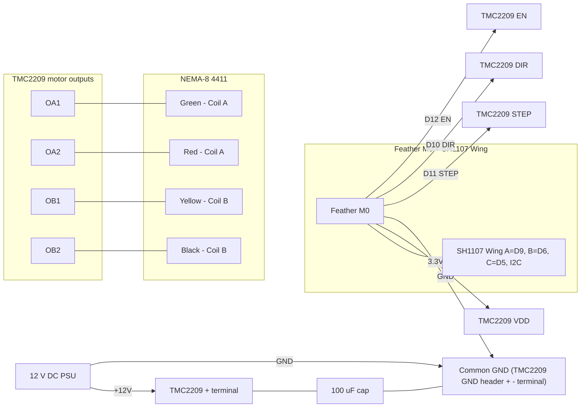

# Mouse-Treadmill Phase 1 — Wiring and Firmware Reference

> Phase 1 bench setup: drive the NEMA-8 stepper with the TMC2209 from the Feather M0,
> using the SH1107 FeatherWing's three buttons for Speed+ / Start-Stop / Speed–
> and showing live status on the OLED.

---

## 1. Bill of materials

| Part | Adafruit PID | Role |
|------|-------------|------|
| Feather M0 Basic Proto (ATSAMD21G18) | 2772 | 3.3 V logic MCU |
| SH1107 128x64 OLED FeatherWing | 6313 | I2C display + 3 tactile buttons |
| TMC2209 Stepper Driver breakout | 6121 | STEP/DIR standalone driver with Vref trim pot |
| NEMA-8 bipolar stepper | 4411 | 200 steps/rev, 600 mA/phase, 4 wires |
| External 12 V DC supply | — | Motor bus voltage |
| 100 uF electrolytic capacitor (≥25 V) | — | Decoupling on motor terminal block |
| Breadboard / Perma-Proto, jumpers | — | |

---

## 2. Power strategy

The Adafruit 6121 requires **two independent supplies**:

- **VDD pin (header)** ← Feather **3.3 V** — logic supply for the chip. Without it the motor outputs stay disabled even if the motor supply is present.
- **`+` terminal block pin** ← **+12 V DC** from the external PSU (valid range 5–29 V) — motor bus voltage.
- **GND header pin** and **`-` terminal block pin** are the same net on the board. Tie the Feather GND, the TMC2209 GND header pin, the `-` terminal, and the PSU negative all together. A single shared ground is required for reliable STEP/DIR signal integrity.

Key notes:
- Powering only VDD → chip appears alive, motor does nothing.
- Powering only `+` → outputs not driven; motor silent.
- The 3.9 V motor rating is not the bus voltage. The TMC2209 chops coil current, so VMOT can (and should) be much higher than rated motor voltage — 12 V gives clean, quiet performance for this motor.
- Place the 100 uF electrolytic directly between the `+` and `-` terminal block pins, as close to the driver as possible.
- Set coil current with the on-board trim pot: start fully counter-clockwise (minimum), then increase slowly until the motor runs smoothly without the driver IC or motor getting hot. The Adafruit pinout guide notes the pot covers up to ~2 A max; target ~0.6 A RMS for the 4411.

---

## 3. Pin map

The FeatherWing stacks on top of the Feather M0 and consumes SDA, SCL, D5, D6, D9. Pins D10–D13 are free for the driver.

### OLED FeatherWing (fixed by the board)

| Signal | Feather pin |
|--------|------------|
| I2C SDA/SCL | SDA, SCL |
| Button A — Speed + (hold to ramp) | D9 |
| Button B — Start / Stop | D6 |
| Button C — Speed − (hold to ramp) | D5 |

All buttons are active LOW; use `INPUT_PULLUP`. Verified pin assignment matches Adafruit's official `OLED_featherwing.ino` example for M0/32u4/M4.

### TMC2209 driver (Adafruit 6121 silkscreen labels)

| Signal | Connection |
|--------|-----------|
| STEP | Feather D11 |
| DIR | Feather D10 |
| EN | Feather D12 (active LOW; HIGH = disabled/idle) |
| VDD | Feather 3.3 V |
| GND | Feather GND (also tied to PSU GND via `-` terminal) |
| `+` terminal | +12 V PSU |
| `-` terminal | PSU GND |
| MS1, MS2 | Leave open or tie to GND → 1/8 microstepping (default) |
| PDN_UART | Leave as board default (standalone mode, no UART in Phase 1) |
| Motor outputs | See motor wiring table below |

### Motor wiring — Adafruit 4411 (Green / Red / Yellow / Black leads)

Confirmed working on hardware:

| Driver pin | Wire color | Coil | Resistance |
|-----------|-----------|------|-----------|
| OA1 (1A) | Green | Coil A | ~7 Ω |
| OA2 (2A) | Red | Coil A | ~7 Ω |
| OB1 (1B) | Yellow | Coil B | ~7 Ω |
| OB2 (2B) | Black | Coil B | ~7 Ω |

Verification with a multimeter before powering VMOT:
- Green ↔ Red ~= 7 Ω
- Yellow ↔ Black ~= 7 Ω
- Any Coil A wire ↔ any Coil B wire = open circuit

Polarity within a pair only affects spin direction. If the motor runs the wrong way, swap just OA1↔OA2 (or just OB1↔OB2). Never cross wires between coils — that produces buzzing or no motion and can stress the driver. Never plug or unplug the motor while VMOT is live.

---

## 4. Wiring diagram



---

## 5. Firmware

**File:** `firmware/mouse_treadmill/mouse_treadmill.ino`

### Libraries (Arduino Library Manager)

- `Adafruit GFX Library`
- `Adafruit SH110X`
- `AccelStepper`
- `Adafruit Zero Timer Library` ← required for ISR-driven step generation (see Phase 1b)

### Key constants (top of sketch)

| Constant | Default | Description |
|----------|---------|-------------|
| `STEPS_PER_REV` | 200 | Full steps per revolution |
| `MICROSTEPS` | 8 | Matches MS1/MS2 strap (1/8) |
| `SPEED_MAX` | 20000 | Hard ceiling in usteps/s |
| `TARGET_RAMP_RATE` | 4000 | usteps/s per second while A or C is held |
| `MOTOR_ACCEL` | 8000 | usteps/s² motor chase rate |
| `ISR_PERIOD_TICKS` | 480 | TC3 compare value; 480 × 1/48 MHz = 10 µs |

### Pin defines

```
STEP_PIN = 11   DIR_PIN = 10   EN_PIN = 12
BTN_A = 9   BTN_B = 6   BTN_C = 5
```

### Behaviour

- **Boot:** driver disabled (EN HIGH), OLED splash, `[STP]` state.
- **Hold A:** `userTarget` ramps up at `TARGET_RAMP_RATE` usteps/s per second.
- **Hold C:** `userTarget` ramps down.
- **Tap B:** toggle running. On start, driver is enabled before the ramp begins. On stop, `currentSpeed` ramps to 0 and the driver EN pin goes HIGH only once it reaches 0 (graceful stop).
- Step pulses are generated from a TC3 hardware timer ISR (every ~10 µs), so OLED redraws cannot starve the pulse train.

---

## 6. Bring-up / test sequence

1. Flash firmware with the motor **unplugged**. Confirm OLED shows splash then `[STP]`, and buttons change speed/state.
2. Power down. Wire the motor per the table above. Set the Vref trim pot fully counter-clockwise.
3. Apply 12 V to the `+` terminal, power the Feather over USB. Tap B to start; hold A for a slow crawl.
4. If the motor stutters or buzzes, swap OA1↔OA2 — that corrects a reversed coil polarity.
5. Raise Vref slowly until the motor runs smoothly under load without the driver or motor getting hot.
6. Hold A until the motor stalls; note that speed as the practical `SPEED_MAX` and reduce the constant to that value plus a small margin.

---

## 7. Out of scope for Phase 1 (future phases)

- UART tuning of the TMC2209 (StealthChop thresholds, software current control, stall detection via DIAG)
- Encoder / closed-loop speed feedback
- Logging speed to host PC for experimental records
- Direction reversal from buttons
- Enclosure, belt/roller mechanical coupling to treadmill drum
